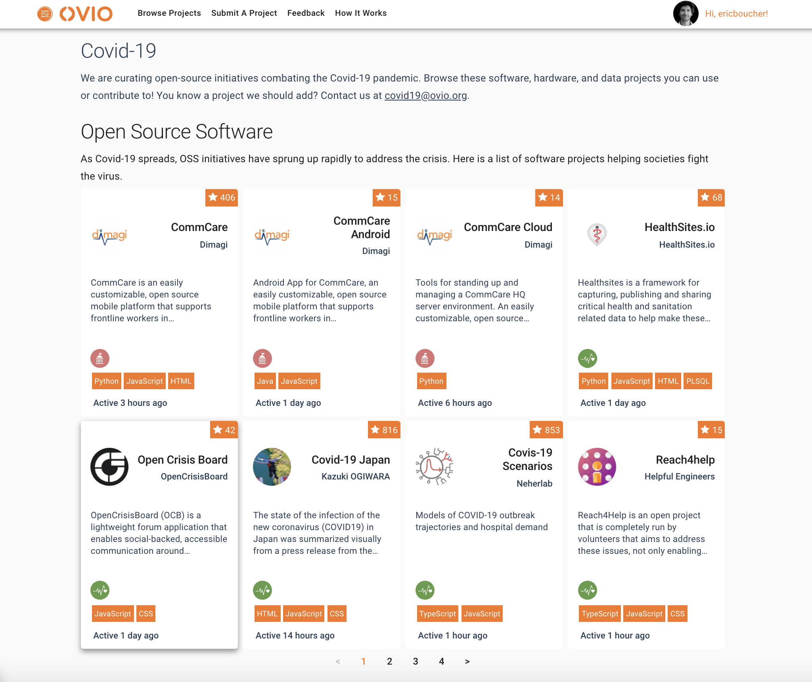

# COVID-19 Open Source Projects & Initiatives

A collaborative list of open source efforts in the fight against the covid-19 pandemic. Ready to view on [explore/covid-19](https://explore.ovio.org/covid-19)

## Why is Ovio doing this?

The world is facing an unprecedented crisis. People from all around the world have been coming together and are deploying an incredible amount of enerrgy to fight this pandemic. In just a few weeks, the open-source community has seeen thousands of projects and millions of contributors deploy their energy and skills.

With everybody on our planet facing a common threat, open-source is a super-power, catalyzing the knowledge of everyone.

Unfortunately, with so many individuals and groups hacking towards similar goals, and despite working in the open, we are also witnessing an extraordinary level of duplication.

Our hope is to play our part in focusing efforts of developers, data-scientists and hackers to avoid duplication and maximize the impact of key projects.

As this is such an important cause to many people at this time, we've decided to work on this list as openly and collaboratively as possible.

### Centralize & Connect

Our work will consisist of scooting and curating the most promising endeavors, and we need your help!
In addition, we are leveraging our network and our [platform](https://explore.ovio.org) to connect developers to open-source projects that need their skills.

## Open data

Open source is bigger than any company or community. The project list is released under [CC0-1.0](#license) for anyone to use and learn from.

One file [projects.json](https://github.com/oviohub/covid-19-projects/blob/master/projects.json).

### Contributing

This is a collaborative projects and contributions are more than welcome. Have a look at our [Contributing.md](https://github.com/oviohub/covid-19-projects/blob/master/CONTRIBUTING.md) and join the effort!

## License

The data and associated documentation in this repo are open data released under the very permissive [CC0-1.0](LICENSE) public domain dedication. However, please understand that each project is licensed under their own terms (visit individual project repositories for details).
